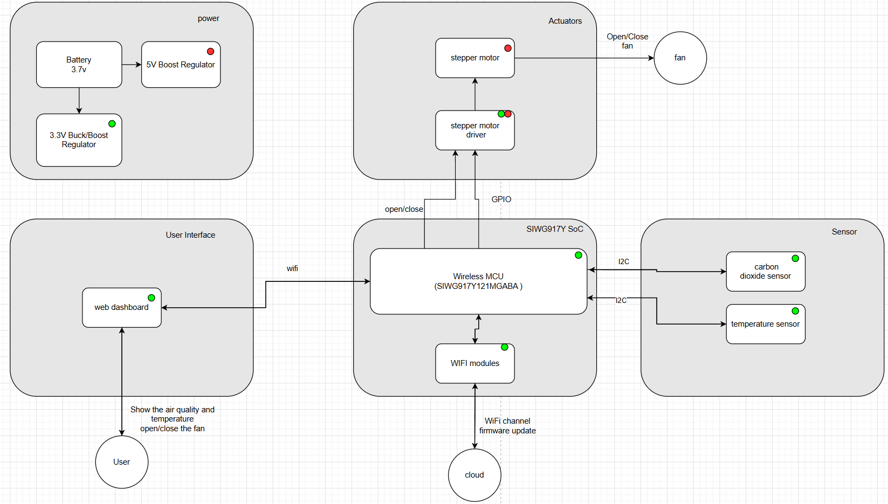
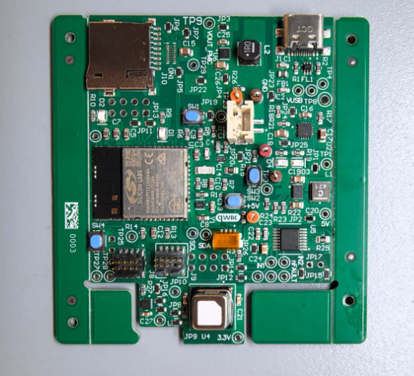
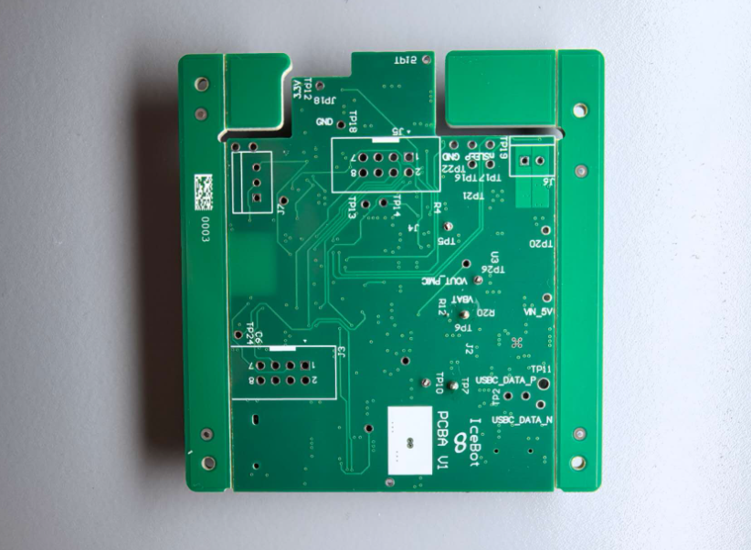
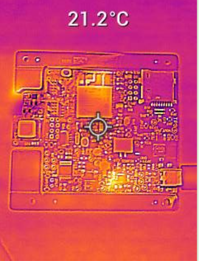
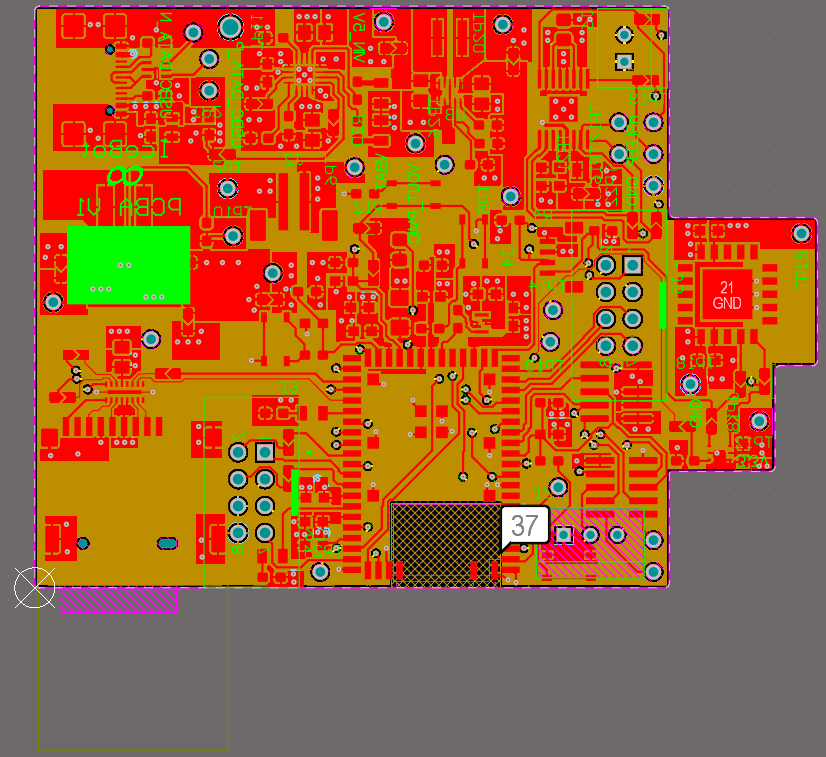
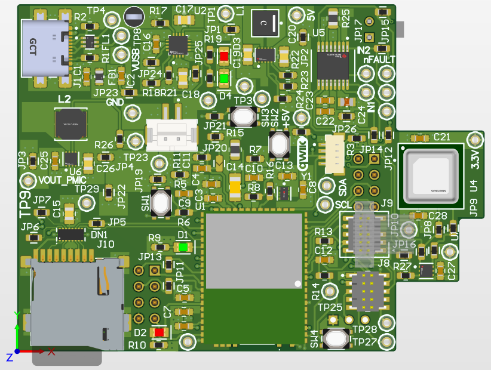
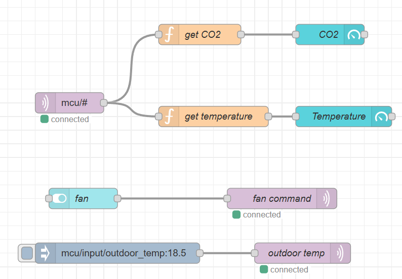
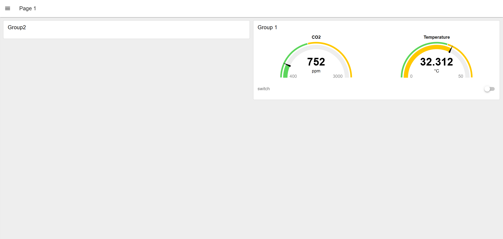
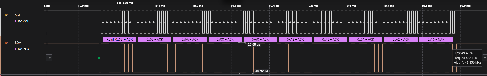

# A11G Final Submission

**Team Number:** 33

**Team Name:** ICEBOT

**GitHub Repository URL: [https://github.com/ese5160/final-project-firmware-s26-t33-icebot.git](https://github.com/ese5160/final-project-firmware-s26-t33-icebot.git)**

| Team Member Name | Email Address          | GitHub Handle  |
| ---------------- | ---------------------- | -------------- |
| Nhlanhla Mavuso  | nmavuso@seas.upenn.edu | nmavuso        |
| Bowen Wang       | wangbw@seas.upenn.edu  | Bowen-wang-sps |

## 1. Video Presentation

[https://drive.google.com/file/d/1nqz-cipcTq82vQqblX3P7MjoigyQHmAM/view?usp=sharing](https://drive.google.com/file/d/1nqz-cipcTq82vQqblX3P7MjoigyQHmAM/view?usp=sharing)

<video src="Video_Presentation.mp4" width="600" controls></video>

## 2. Project Summary

An automated air quality and climate control system that monitors CO2 levels and temperature using integrated sensors and a microcontroller. The system will open the fresh air system when the carbon dioxide exceed 1500 ppm or temperature exceed 35 degrees Celsius and the outdoor temperature is below 35 degrees. The system uses remote Wifi connectivity and a battery for on the device.

As people spend more time indoors every day, indoor air quality and temperature are having an increasing impact on human health and comfort. Healthy air quality is important for people's health, so we decided to develop a device that monitors indoor air quality and temperature and automatically turns on a fresh air system when needed.

The internet help our device to acquire the data of the outdoor temperature and the signal of motor. The internet also help our device to show the indoor air quality and temperature. The devide can get the firmware update via the internet.

This device include a temperature sensor, a carbon dioxide sensor, a 3.3V Buck regulator, a 5V Buck Boost regulator, a stepper motor driver, a motor and a MCU. The 3.3V Buck regulator and the 5V Buck Boost regulator convert the 3.7V from battery to 3.3V and 5V. The temperature sensor and the carbon dioxide sensor are connected to a same I2C bus. The MCU read the different data by addressing the corresponding device on the bus. The device sends sensor readings to an MQTT broker running on an Azure virtual machine, and the data is displayed on a Node-RED dashboard. This device also can eceive the signal from the dashboard to open or close the motor.

When I tried to read data from the co2 sensor, I was not able to get a response. After using the logic analyzer to check the I2C communication, I found that the inductor used by the 5V regulator was damaged. The damaged inductor caused the heat which damaged the PCB. I solved this problem by replacing the PCB with another one.

Through this lesson, I learned how one component on a PCB can affect another component. When I design the PCB, I need to consider the different factors, including the heat of the component, the trace current capacity, and the impact of trace length on signal integrity and noise.

If I had to redesign the device, I would place the sensors, especially the temperature sensor, on a separate PCB to reduce thermal interference from the voltage regulator. In addition, I would use a higher power motor because the current 5V fan does not provide enough airflow.

To finish and improve this project, I would redesign the PCB to reduce thermal interference between the voltage regulator and the sensors. I will place the sensors on a separate PCB and design a port to connect them. In order to use a higher power motor, I would add a 12V boost converter to power it.

What did you learn in ESE5160 through the lectures, assignments, and this course-long prototyping project?

Through ESE5160, I learned how to design and build an internet-connected device. I learned how to draw the schematic diagram and learned how to create a PCB layout, place components, route traces, and consider power, signal integrity, and thermal effects.  I also learned how to use FreeRTOS for task management, read sensor data from multiple devices through I2C, and communicate with the cloud.

[http://20.109.169.128:1880/dashboard/page1](http://20.109.169.128:1880/dashboard/page1)

[http://20.109.169.128:1880/#flow/e53987c2a2b3cb99](http://20.109.169.128:1880/#flow/e53987c2a2b3cb99)

[https://upenn-eselabs.365.altium.com/designs/AA02036A-4788-4411-8F6F-719C995EFF49](https://upenn-eselabs.365.altium.com/designs/AA02036A-4788-4411-8F6F-719C995EFF49)

## 3. Hardware & Software Requirements

## Hardware Requirements Specification (HRS)

| ID               | Description                                                                                                                                                                                                                       | met or not                                                                                                                                                                                                                                                                                                                                                                           |
| ---------------- | :-------------------------------------------------------------------------------------------------------------------------------------------------------------------------------------------------------------------------------- | ------------------------------------------------------------------------------------------------------------------------------------------------------------------------------------------------------------------------------------------------------------------------------------------------------------------------------------------------------------------------------------- |
| **HRS-01** | A carbon dioxide sensor shall be used for CO2 monitoring. The sensor shall have a a measurement range of 400 – 5000 ppm  with accuracy of +- 50 ppm +-5% of reading and a response time  of less than 30 seconds. | The sensor can detect the concentration of carbon dioxide. Because There we do not have the equipment to detect the carbon dioxide, we cannot determine whether  the reading is accurate. According to the data sheet, the accuracy satisfy the  requirement. The typical response time of this sensor is 60s, and it do not  satisfy the requirement. |
| **HRS-02** | A digital temperature sensor shall be used for ambient  temperature measurement. The measurement range will be from 0 degrees celcius to  80 degrees celcius, with a measurement precision of 0.5 degrees celcius. | Because the temperature sensor is affected by the heat generated by the voltage regulator, the sensor readings are not accurate. This was identified by comparing  the sensor readings with the thermometer.                                                                                                                                                          |
| **HRS-03** | An LCD screen display shall be used for local data visualization. The screen shows CO2 Levels, temperature, motor status, weather,  and wifi status.                                                                    | I replaced the physical display with a web dashboard.                                                                                                                                                                                                                                                                                                                                 |
| **HRS-04** | A DC brushed or brushless motor shall be used for ventilation. The motor  shall  draw 1.5 A and support PWM variable speed control.                                                                                          | Not meet, the motor runs at a fixed speed because the fan has a relatively low airflow.                                                                                                                                                                                                                                                                                               |

## Software Requirements Specification (SRS)

| **ID**     | **Description**                                                                                                                                                       | met or not                                                                                                                                                               |
| ---------------- | --------------------------------------------------------------------------------------------------------------------------------------------------------------------------- | ------------------------------------------------------------------------------------------------------------------------------------------------------------------------- |
| **SRS-01** | The firmware regularly detects the CO2 sensor and temperature sensor and acquire current readings.                                                                     | Met, the sensor can detect the concentration of carbon dioxide and the temperature.                                                                                     |
| **SRS-02** | The system shall transmit sensor data to the cloud via WIFI to the user.                                                                                               | Met, the system sent sensor data to the cloud via WIFI and showed on the web dashboard.                                                                                 |
| **SRS-03** | When Wi-Fi is available, the system will receive  the outdoor weather from the cloud and check  the firmware update.                                            | Met, system received the outdoor weather from the cloud and updated the firmware.                                                                                       |
| **SRS-04** | The system will use the data of outdoor weather and concentrations of carbon dioxide and temperature to decide whether it will activate the ventilation motor | Met, system opened the motor when the carbon dioxide exceed 1500 ppm or temperature exceed 35 degrees Celsius and the outdoor temperature is below 35 degrees. |
| **SRS-05** | When the thresholds exceed CO2 > 1500 ppm or  temperature > 35 degrees celcius, the system  will send a warning to the cloud.                                   | The system showed the concentration of carbon dioxide and the temperature on the web dashboard                                                                         |
| **SRS-06** | The system can receive the signal and open or  close the fresh air system after the button is pressed                                                                | Met, the motor was opened or closed after the signal.                                                                                                                   |

## 4. Project Photos & Screenshots

Your final project, including any casework or interfacing elements that make up the full project (3D prints, screens, buttons, etc)

## 5. Codebase

[https://github.com/ese5160/final-project-firmware-s26-t33-icebot.git](https://github.com/ese5160/final-project-firmware-s26-t33-icebot.git)
